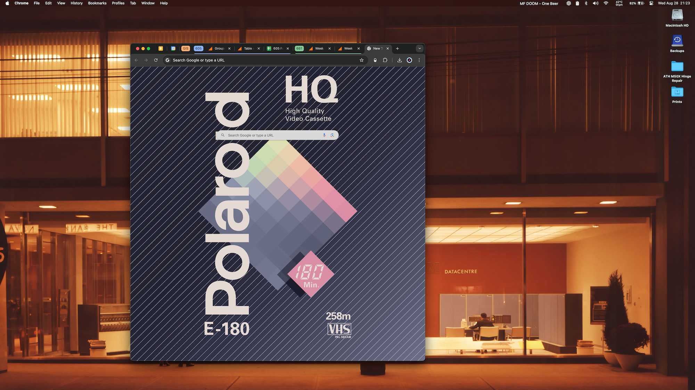

# New-Tab-No-Doodles & Custom Background

*Source code cloned from: [New Tab No Doodles](https://chromewebstore.google.com/detail/elinkdhiglllcjpdilenamlilknhbppj?hl=en)*

### Problem:

* I got sick of the daily google doodle.

### Solution:

* New Tab No Doodles is a good tool but the HTML page it renders has two matte backgrounds & I'm a big fan of the custom image background that you can set on your Chrome & Safari New Tab pages. 

* Download extension and modify css to load my images.

* Have greater control over what icons and text appears on my new tab page.
